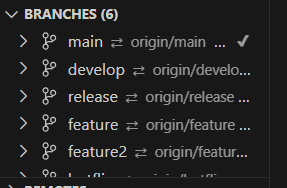
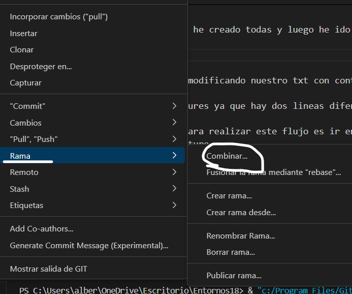
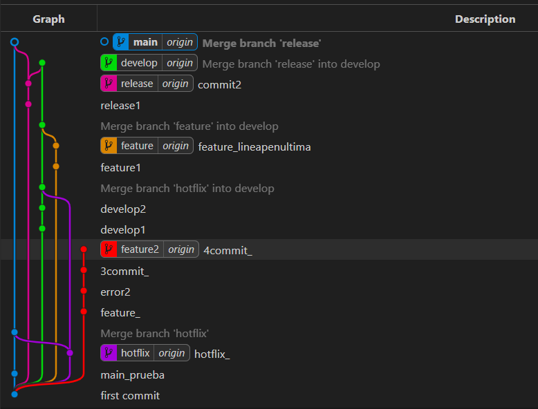

# Tarea Tema 18.

## Realizado mediante interfaz gráfica

### Breve explicacion

    Los circulos son los commit que habria que realizar excepto si a un commit le apuntan dos flechas en  la misma direccion.

### Proceso
    Para crear las ramas nos metieriamos en la barra lateral en el icono de git y abriramos branches y le dariamos al mas para crear dichas ramas.

    Yo primero de todo las he creado todas y luego he ido haciendo el proceso. 

    

    Lo siguiente seria ir modificando nuestro txt con contenido para poder hacer los commit de cada una de las ramas.

    Se han creado dos features ya que hay dos lineas diferentes una con merge y otra sin ella.

    Lo más imnportante para realizar este flujo es ir en orden y preferiblemente resolver antes los flujos sencillos como los de la ultima linea de feature.

### Merge
    Para combinar las ramas siempre preferiblemente habria que coger el entrante para que se refleje el cambio en un commit.

    

### Imagen del flujo
    
